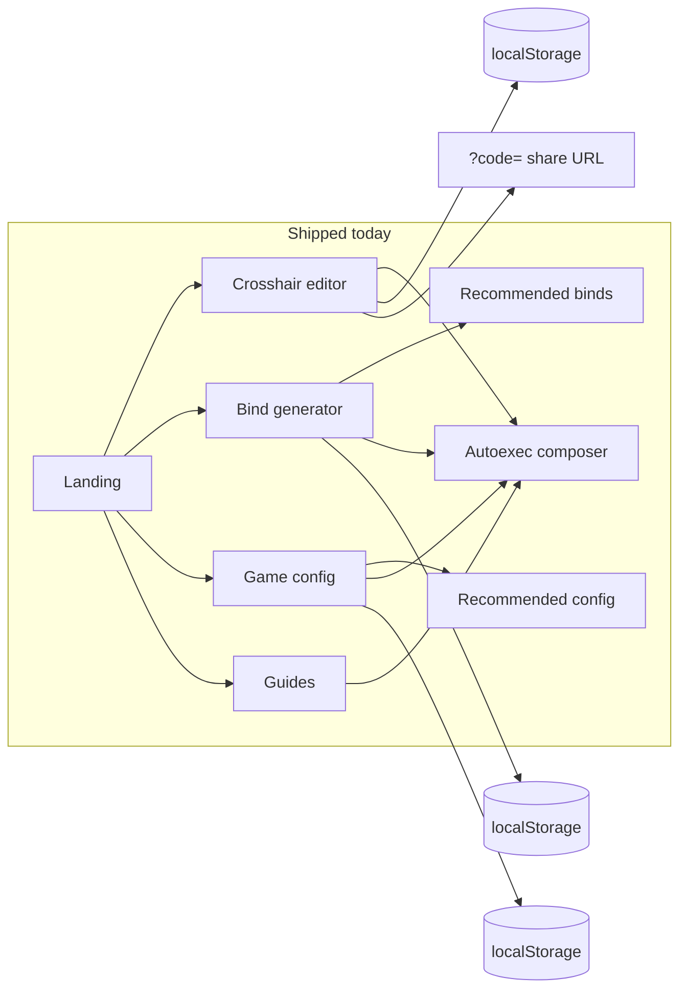
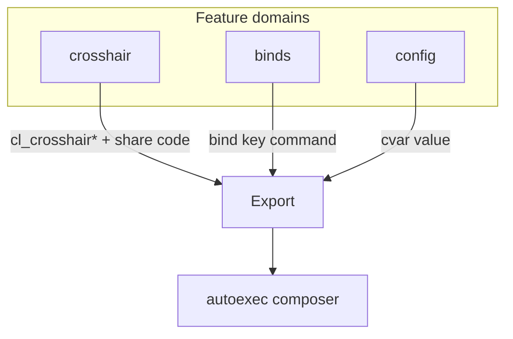
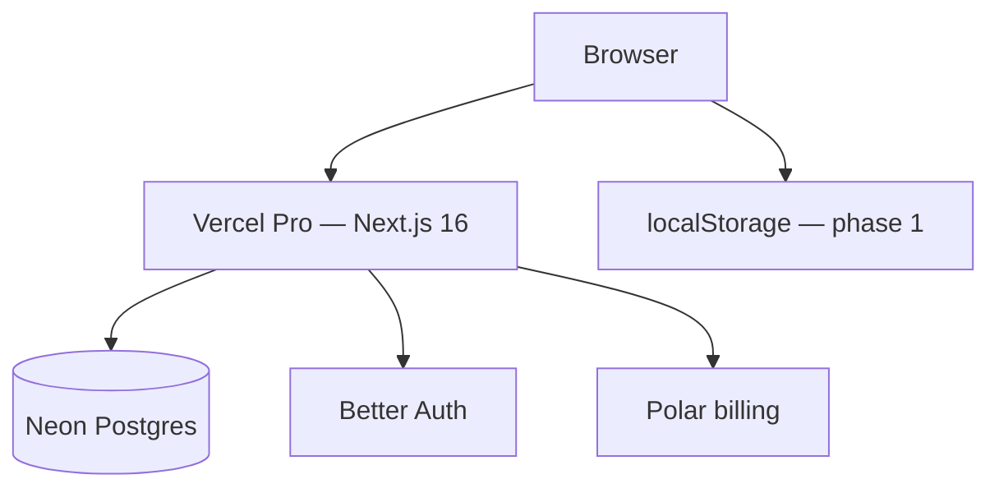
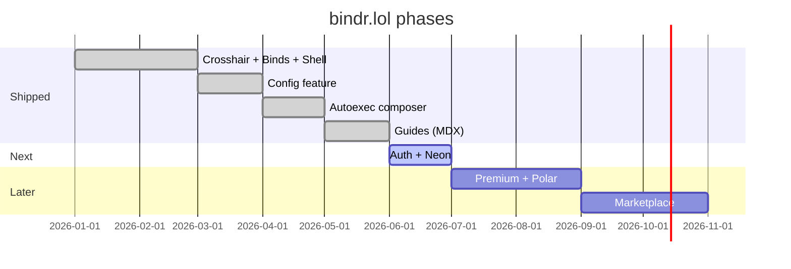

# bindr.lol — Product & Engineering Spec

> **bindr.lol** is a browser-only CS2 config studio: crosshairs, binds, game settings, and autoexec export — no downloads, no cheats.

---

## Table of contents

1. [Vision](#1-vision)
2. [Current product (shipped)](#2-current-product-shipped)
3. [Domain model](#3-domain-model)
4. [Routes & navigation](#4-routes--navigation)
5. [Feature reference](#5-feature-reference)
6. [Tech stack](#6-tech-stack)
7. [Data & auth](#7-data--auth)
8. [Codebase architecture](#8-codebase-architecture)
9. [Client patterns](#9-client-patterns)
10. [Roadmap](#10-roadmap)
11. [Agent guardrails](#11-agent-guardrails)

---

## 1. Vision

### Problem

CS2 players juggle share codes, bind lines, viewmodel cvars, and autoexec files across forums, spreadsheets, and fragmented tools. Most utilities require installs or live outside the browser.

### Solution

A web SaaS where players **import → customize → preview → export** everything in one place, then optionally **save to cloud**, **go premium**, or **browse a creator marketplace**.

### Principles

| Principle | Meaning |
|-----------|---------|
| **Browser-first** | Parse, preview, and export client-side. No `.exe`, no memory tools. |
| **Trust** | MM-safe defaults, clear labels, no VAC-adjacent features. |
| **Local-first → cloud** | `localStorage` until auth; Neon sync after sign-in. |
| **Screaming architecture** | Folders named after product features, not technical layers. |

### Business model (later)

- **Free:** editors + localStorage + basic export
- **Premium (Polar):** cloud slots, private configs, early features
- **Marketplace (Polar):** public creator configs, revenue share

---

## 2. Current product (shipped)

**Phases 1.0–1.7 — complete.** No auth required.



### Site shell

| Item | Status | Location |
|------|--------|----------|
| Landing page (console hero, tool cards, value props) | Shipped | `/` |
| Nav (grouped dropdowns) + breadcrumb + footer | Shipped | `shared/ui/site-nav.tsx`, `site-breadcrumb.tsx`, `site-footer.tsx` |
| Theme toggle (`t` hotkey) | Shipped | `features/theme/` |
| Metadata / branding `bindr.lol` | Shipped | `app/layout.tsx` |
| Guides (MDX articles) | Shipped | `/guides`, `features/guides/` |

### Crosshair editor — `/crosshair`

| Capability | Details |
|------------|---------|
| Share-code codec | In-repo port of [girlglock/cs2-crosshair](https://github.com/girlglock/cs2-crosshair). **Do not use `csgo-sharecode` npm.** |
| Live preview | Canvas crosshair over map backgrounds (Inferno, etc.) |
| Controls | Style, gap, color, dynamic/split toggles, sliders |
| Import | Paste share code dialog |
| Export | Console commands, share code, copy menu |
| Persistence | `bindr:crosshair:v1` in localStorage |
| URL sync | `?code=CSGO-…` (debounced, case-sensitive) |

**State:** Zustand store (`crosshair-store.ts`) for cross-route reads (autoexec composer). URL sync stays in `use-crosshair-editor.ts` via nuqs.

### Bind generator — `/binds`

| Capability | Details |
|------------|---------|
| Keyboard UI | Click key → assign console command |
| Bind list | Grouped by category (utility, weapons, radar, lineups, custom) |
| Export | Copy bind lines or grouped `.cfg` snippet with header comments |
| Empty start | Editor starts with no binds; user builds or imports |
| Confirm dialogs | **Clear all** and **Add all** require confirmation |
| Disabled states | Clear all when empty; Add all when catalog fully added |

**State:** Zustand store (`bind-store.ts`) shared across editor and recommended pages. Saves to `bindr:binds:v1` on every mutation.

### Recommended binds — `/binds/recommended`

| Capability | Details |
|------------|---------|
| Catalog | 10 curated MM-safe templates (2026 meta keys) |
| Categories | Utility (grenade slots), weapons, radar, lineups |
| UX | Add/remove individually; **Add all** replaces entire config (with confirm) |
| Examples | Z/X/C grenades, Q knife, G drop, N `-attack` lineup release, F9/F10 radar |

---

## 3. Domain model

Three **separate features**. Never mix them in one UI or export block without explicit composition (autoexec phase).



| Feature | What it is | Examples | Export |
|---------|------------|----------|--------|
| **crosshair** | Valve share-code settings | gap, thickness, color, style | `cl_crosshair*` commands + `CSGO-…` code |
| **binds** | Key → command mappings | `bind c slot8`, radar toggles | `bind "key" "command"` |
| **config** | Always-on cvars (no key) | viewmodel FOV/offsets, radar scale | `viewmodel_fov 68` |

### Binds vs config (viewmodel)

**Binds** answer: *“When I press this key, run this command.”*

**Config** answers: *“These settings should always be applied.”*

Viewmodel is **config**, not binds:

```cfg
viewmodel_fov 68
viewmodel_offset_x 2.5
viewmodel_offset_y 2
viewmodel_offset_z -2
```

These are console variables, not `bind` lines. They belong in `features/config/` with slider/form UI — not in the keyboard bind generator. (We briefly had viewmodel under binds; it was removed.)

---

## 4. Routes & navigation

Route **groups** organize code; **URLs stay flat**.

```
app/
├── layout.tsx                 # SiteShell, metadata
├── (home)/
│   └── page.tsx               # /
└── (feat)/
    ├── crosshair/page.tsx     # /crosshair
    ├── binds/
    │   ├── page.tsx           # /binds
    │   └── recommended/page.tsx  # /binds/recommended
    ├── config/
    │   ├── page.tsx           # /config
    │   └── recommended/page.tsx  # /config/recommended
    ├── autoexec/page.tsx      # /autoexec
    └── guides/
        ├── page.tsx           # /guides
        └── [slug]/page.tsx    # /guides/:slug (SSG)
```

| URL | Page | Nav label |
|-----|------|-----------|
| `/` | Landing | — (logo on inner pages) |
| `/crosshair` | Crosshair editor | crosshair |
| `/binds` | Bind generator | binds |
| `/binds/recommended` | Recommended catalog | binds (sub-nav) |
| `/config` | Game config | config |
| `/config/recommended` | Recommended config catalog | config (sub-nav) |
| `/autoexec` | Autoexec composer | autoexec |
| `/guides` | Guides index | guides |
| `/guides/:slug` | Guide article (MDX, SSG) | — (breadcrumb) |

**Nav pattern:** `NavigationMenu` with grouped dropdowns — **editors** (crosshair, binds, config, autoexec) and **catalogs** (recommended binds/config) — plus a top-level **guides** link. Inner pages show a dynamic breadcrumb (`shared/ui/site-breadcrumb.tsx`); footer lists all tools + theme hint.

---

## 5. Feature reference

### 5.1 Crosshair (`features/crosshair/`)

```
features/crosshair/
├── hooks/use-crosshair-editor.ts
├── lib/
│   ├── model/          # types, defaults, color, style
│   ├── share-code/     # encode, decode, dictionary
│   ├── rendering/      # canvas render, map backgrounds
│   ├── export/         # console commands, share URL
│   └── storage/        # crosshair-storage.ts
└── ui/
    ├── editor/         # main editor, reset alert, import dialog
    ├── controls/       # sliders, style select, color picker
    └── preview/        # map preview, copy menu
```

**Agent notes:**

- Share codes are **case-sensitive** — never uppercase before decode.
- Use `decodeShareCode` / `encodeShareCode` from `@/features/crosshair/lib/share-code/`.

### 5.2 Binds (`features/binds/`)

```
features/binds/
├── hooks/use-bind-editor.ts      # thin wrapper over store
├── lib/
│   ├── model/                    # types, keyboard layout, recommended-binds
│   ├── export/                   # format-bind, format-cfg, lineup notes
│   └── storage/                  # bind-storage.ts, bind-store.ts (Zustand)
└── ui/
    ├── editor/                   # bind-editor, binds-nav
    ├── controls/                 # keyboard, bind-list, command form, confirm dialog
    ├── recommended/              # catalog page + cards
    └── export/                   # copy/export panel
```

**CFG export:** grouped by category, header `// Generated by Bindr`, lineup notes for MM-blocked jump-throw aliases.

### 5.3 Config (`features/config/`) — 1.5 shipped

| Section | Cvars (examples) | UI |
|---------|------------------|-----|
| Viewmodel | FOV, offset X/Y/Z, presets, handedness, bob | Sliders + presets + toggle |
| Mouse | sensitivity, zoom ratio, raw input | Sliders + toggle |
| Radar | scale, hud scale, rotate, icon size | Sliders + toggles |
| Network | rate, interp, cmd/updaterate, max ping | Selects + sliders |
| Audio | master, voice, music, 10s warning | Sliders + toggle |
| Performance | fps caps, tracers, dynamic light, multicore | Toggles + sliders |
| HUD | color, scale, teammate colors, loadout | Selects + toggles |

- Persist: `bindr:config:v1`
- Export: `// config` block (per-section `// viewmodel` … `// hud` headers)
- Editor has sticky section nav, **Add all recommended**, reset; `/config/recommended` catalog
- MM-safe only; flag tournament-sensitive options

### 5.4 Autoexec composer (`features/autoexec/`) — 1.6 shipped

Merges slices from all three features into one file via `composeAutoexec`:

1. Crosshair commands (+ share code comment)
2. Config cvars (`formatConfigBody`)
3. Bind block (`formatBindBody`)

Optional ASCII `bindr.lol` banner echoed on load (`autoexec-banner.ts`, figlet
"Slant", kept free of `"`/`//`/`;` so the Source 2 console parser accepts it).
Per-section include toggles; output ends with `host_writeconfig`. Reads the
crosshair, config, and binds Zustand stores read-only — no re-implemented export
logic. Downloadable / copy-paste `autoexec.cfg`; per-feature export remains.

### 5.5 Guides (`features/guides/`) — 1.7 shipped

MDX-backed articles (setup tricks, walkthroughs) rendered with the site theme —
**not** fumadocs. Native `@next/mdx` keeps the docs in the existing shell with
zero CSS conflicts.

```
features/guides/
├── content/            # *.mdx article bodies
├── lib/                # registry (slug → meta + lazy import), get-guides, format-date
└── ui/                 # guides-index, guide-article, mdx-components (themed), guide-image
```

- **Pipeline:** `createMDX` + `pageExtensions` in `next.config.ts`; root
  `mdx-components.tsx` adapter; `*.mdx` module declaration in `src/types/`.
- **Registry:** metadata is typed in `lib/registry.ts` (no frontmatter parsing);
  each entry lazy-loads its MDX via a statically analyzable `import()`.
- **Routing:** `/guides` index + `/guides/[slug]` with `generateStaticParams`
  (SSG) and per-article `generateMetadata`.
- **Components:** markdown maps to themed elements (mono headings, inline/block
  code, lists, blockquote); links → `next/link`, external get `rel="noopener"`;
  images → `next/image` via `guide-image.tsx`. Assets in `public/guides/` (webp).
- **Add a guide:** drop an `.mdx` in `content/` + one entry in `registry.ts`.

Shipped article: *Share one config across every CS2 account* (the `USRLOCALCSGO`
env-var trick), which links back to `/autoexec`.

---

## 6. Tech stack



| Layer | Choice | Role |
|-------|--------|------|
| **Monorepo** | Turborepo + Bun | `apps/web`, `packages/ui`, `packages/ts-config` |
| **Frontend** | Next.js 16 App Router, React 19, Tailwind 4, TypeScript | RSC + client features |
| **UI** | shadcn / `@workspace/ui` | Install components on demand via CLI |
| **State** | Zustand (crosshair, binds, config), nuqs (crosshair URL), localStorage | Persist in store mutators |
| **Hosting** | **Vercel Pro** | Production; Fluid Compute for functions |
| **Database** | **Neon** Postgres | Via Vercel Marketplace — **not Supabase** |
| **Auth** | **Better Auth** + OAuth | See [§7.1](#71-authentication) |
| **Payments** | **Polar** | Subscriptions + creator payouts (Stripe-backed) |
| **Lint/format** | Ultracite (Biome) | `bun x ultracite fix` |

### Environment variables (phase 2+)

| Variable | Purpose |
|----------|---------|
| `DATABASE_URL` | Neon connection string |
| `BETTER_AUTH_SECRET` | Session encryption (≥32 chars) |
| `BETTER_AUTH_URL` | `https://bindr.lol` |
| `BETTER_AUTH_*_CLIENT_*` | OAuth provider credentials |
| `POLAR_*` | Webhook secret, access token |

---

## 7. Data & auth

### 7.1 Authentication

**Target identity:** Steam (`SteamID64`, persona, avatar) — natural for CS2.

**Constraint:** Better Auth has **no native Steam provider** (Steam uses OpenID 2.0, not OAuth2).

| Phase | Approach |
|-------|----------|
| **2.0 MVP** | Better Auth + one supported OAuth (Google, Discord, or GitHub — TBD). Cloud save works without Steam. |
| **2.x** | Link Steam via custom OpenID plugin or when Better Auth adds support. `steam_id` nullable until then. |

**Rules:**

- Verify session **inside** every Server Action and API route.
- `trustedOrigins`: `bindr.lol`, Vercel preview URLs.
- Route handler: `/api/auth/[...all]`.

### 7.2 Payments (Polar)

- Checkout + customer portal via Polar — do not integrate Stripe directly unless Polar gaps require it.
- Webhook route: subscription lifecycle → update entitlements in Neon.
- Store `polar_customer_id` on user profile.

### 7.3 Database schema (Neon)

**Better Auth tables** — generated via `@better-auth/cli migrate` (user, session, account, verification).

**App tables:**

```sql
-- Profile extension (or columns on BA user via plugin)
user_profile
  user_id          UUID PK → user.id
  steam_id         TEXT UNIQUE NULL
  polar_customer_id TEXT NULL
  subscription_status TEXT NULL  -- synced from Polar

configs
  id               UUID PK
  user_id          UUID → user.id
  title            TEXT
  share_code       TEXT NULL
  crosshair_json   JSONB
  binds_json       JSONB          -- structured binds (not just text)
  config_json      JSONB NULL     -- viewmodel/radar/network
  autoexec_text    TEXT NULL      -- cached composed export
  is_public        BOOLEAN DEFAULT false
  created_at       TIMESTAMPTZ
  updated_at       TIMESTAMPTZ
```

**Phase 1 localStorage keys (current):**

| Key | Content |
|-----|---------|
| `bindr:crosshair:v1` | `CrosshairSettings` JSON |
| `bindr:binds:v1` | `BindEntry[]` JSON |
| `bindr:config:v1` | `ConfigSettings` JSON |

---

## 8. Codebase architecture

### Screaming architecture rules

1. A directory contains **either files or subdirectories** — never both.
2. `app/` = thin route adapters only.
3. Logic lives in `features/{domain}/`.
4. shadcn: install to `packages/ui/src/components/` when needed.
5. Heavy work (codec, preview, export) = client-side.

### Repository layout

```
bindr/
├── apps/web/src/
│   ├── app/              # routes (route groups)
│   ├── features/         # crosshair, binds, config, autoexec, guides, home, theme, auth [planned]
│   └── shared/           # fonts, providers, ui shell, hooks
├── packages/
│   ├── ui/               # design system (shadcn)
│   └── ts-config/        # shared TS configs
└── .docs/SPEC.md         # this file
```

### Crosshair codec (mandatory)

```typescript
import { decodeShareCode } from '@/features/crosshair/lib/share-code/decode-share-code';
import { encodeShareCode } from '@/features/crosshair/lib/share-code/encode-share-code';

const crosshair = decodeShareCode('CSGO-AJswe-2jNcK-nMpEQ-rHV5J-5JWAB');
const shareCode = encodeShareCode(crosshair);
```

---

## 9. Client patterns

| Pattern | Where | Why |
|---------|-------|-----|
| No `useEffect` in components | All UI | Derive state, handlers, callback refs. See `.agents/skills/no-use-effect/` |
| `useMountEffect` | `shared/hooks/use-mount-effect.ts` | One-time hydration, DOM subscriptions |
| Zustand + mutator persist | `bind-store.ts` | Cross-route bind state, save in actions not effects |
| `nuqs` + handler persist | `use-crosshair-editor.ts` | URL sync without ref hacks |
| `key` prop reset | `BindCommandForm` | Reset draft when selected key changes |
| Confirm alert dialog | `confirm-alert-dialog.tsx` | Destructive bulk actions |

---

## 10. Roadmap



### Phase 1.0 — Core value loop ✅

- [x] Crosshair editor (codec, preview, export, localStorage, URL sync)
- [x] Bind generator (keyboard, list, cfg export)
- [x] Recommended binds catalog
- [x] Landing, nav, footer, confirm dialogs, Zustand binds store
- [x] Deployed on Vercel (`bindr.lol`)

### Phase 1.5 — Config ✅

- [x] `features/config/` scaffold + `/config` route
- [x] Viewmodel section (FOV, offsets, presets, handedness, bob)
- [x] Mouse, radar, network, audio, performance, HUD sections
- [x] Recommended catalog (`/config/recommended`) + Add all
- [x] localStorage + cfg export block

### Phase 1.6 — Autoexec composer ✅

- [x] Compose crosshair + config + binds into single `.cfg`
- [x] `/autoexec` route with per-section include toggles
- [x] Download / copy

### Phase 1.7 — Guides ✅

- [x] `@next/mdx` pipeline (config, root `mdx-components`, type decl)
- [x] `features/guides/` — typed registry, themed MDX components, image wrapper
- [x] `/guides` index + `/guides/[slug]` (SSG) + nav/footer/breadcrumb wiring
- [x] First guide: share one config across CS2 accounts (`USRLOCALCSGO`)

### Phase 2.0 — Auth + cloud save

- [ ] Neon ↔ Vercel integration, migrations
- [ ] Better Auth + OAuth (interim provider)
- [ ] `features/auth/` — sign-in, session in shell
- [ ] Save/load configs to Neon
- [ ] Optional `steam_id` column for future link

### Phase 2.x — Steam identity

- [ ] Steam OpenID sign-in or account linking
- [ ] Steam avatar/name in UI

### Phase 3.0 — Premium (Polar)

- [ ] Subscription products, checkout, portal
- [ ] Webhook → entitlements
- [ ] Extra cloud slots, private configs

### Phase 3.1 — Marketplace

- [ ] Public config listings (`is_public`)
- [ ] Creator payouts via Polar
- [ ] Browse / import community configs

---

## 11. Agent guardrails

### In scope

- Web UI, client-side parsing/preview/export
- localStorage, Neon CRUD, Better Auth sessions
- Polar webhooks, MM-safe binds and cvars

### Out of scope — never implement

| Forbidden | Reason |
|-----------|--------|
| Game memory injection / internals | Cheats, VAC risk |
| Demo parsing (`demoinfocs-golang`) | Vercel function timeouts |
| VAC bypass / anti-cheat evasion | ToS + trust |
| `csgo-sharecode` npm package | Incorrect bytes; use in-repo codec |

### Implementation checklist (new features)

1. Create `features/{name}/` with `hooks/`, `lib/`, `ui/` subdirs only.
2. Add thin route in `app/(feat)/`.
3. Link from nav/footer if user-facing.
4. localStorage key: `bindr:{feature}:v1`.
5. Export block with clear `// section` headers for autoexec composition.
6. No `useEffect` in components — hook or `useMountEffect` only.
7. Destructive actions → confirm dialog.
8. Run `bun x ultracite fix` before commit.

---

*Last updated: phases 1.0–1.7 shipped (crosshair, binds, config, autoexec, guides) · stack locked: Vercel Pro, Neon, Better Auth, Polar*
